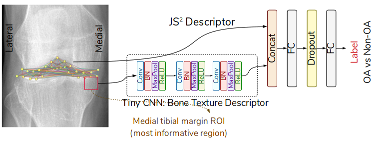

# JS2
A Lightweight CNN and Joint Shape-Joint Space (JS2) Descriptor for Radiological Osteoarthritis Detection

Implementation of "A Lightweight CNN and Joint Shape-Joint Space (JS2) Descriptor for Radiological Osteoarthritis Detection", MIUA 2020 paper.



## Data:
Multicenter Osteoarthritis Study (MOST): http://most.ucsf.edu/

The Osteoarthritis Initiative (OAI): https://nda.nih.gov/oai/

## License
Please cite:
```
@article{bayramoglu2020js2,
  title={A Lightweight CNN and Joint Shape-Joint Space (JS2) Descriptor for Radiological Osteoarthritis Detection},
  author={Bayramoglu, Neslihan and Miika, Nieminen and Saarakkala, Simo},
  journal={MIUA 2020, arXiv preprint },
  year={2020}
}```
